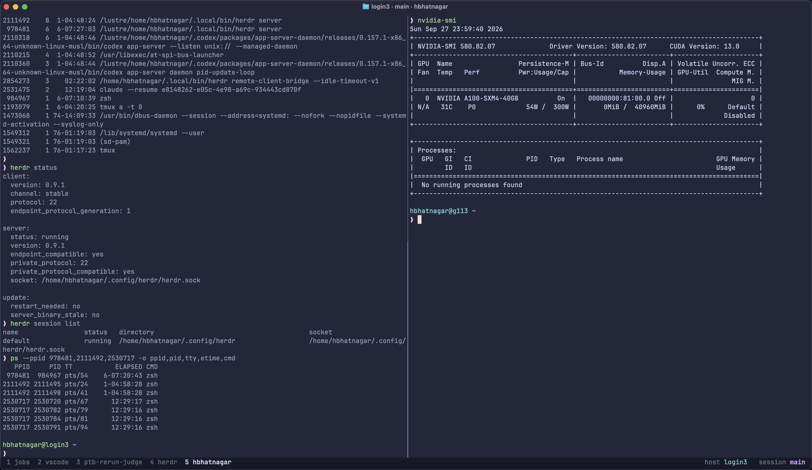
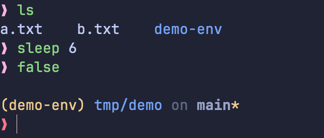

# dotfiles

minimal and sane config files for my local Mac and the cluster I work on.



## contents

| file| use |
|---|---|
| `.zshrc` | zsh config, shared between Mac and cluster (machine-specific parts are split by OS) |
| `.config/ohmyposh/zen.toml` | [Oh My Posh](https://ohmyposh.dev) prompt: user@host, path, git status, Python env, command duration |
| `.tmux.conf` | tmux config with a minimal [catppuccin](https://github.com/catppuccin/tmux) macchiato status bar |
| `.config/ghostty/config` | [Ghostty](https://ghostty.org) terminal config (Mac only) |
| `install.sh` | Symlinks everything into place |

## prompt



## tmux

The prefix is `` ` `` (backtick). Most things also work without the prefix: Ghostty maps Cmd+key to Alt+key, which tmux can use.

| keys | action |
|---|---|
| cmd+h/j/k/l | move between panes |
| cmd+1 to 9 | switch windows |
| cmd+t | new window |
| cmd+d / cmd+shift+d | dplit side by side / top and bottom |
| cmd+z | zoom pane |
| cmd+x / cmd+shift+w | kill pane / kill window |
| cmd+r / cmd+shift+r | rename window / session |
| cmd+shift+s | session picker |
| `` ` `` r | reload config |

A red PREFIX badge shows while the prefix is active, and a yellow COPY badge in copy mode.

## install

```sh
git clone https://github.com/hrdkbhatnagar/dotfiles.git ~/dotfiles
~/dotfiles/install.sh
```

existing files are backed up as `*.backup.<date>` before being replaced with symlinks.

machine specific settings and secrets (API keys, tokens) go in `~/.zshrc.local`, which is loaded at the end of `.zshrc` and is not committed.